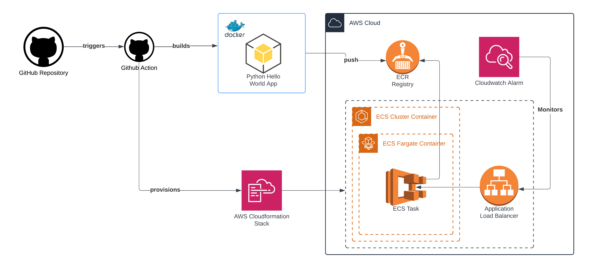

# Python Hello World with ECS Cluster Deployment
Sample Python + Docker Hello World application. Uses a Cloudformation stack based deployment. This will create AWS Architecture if it does not exists, making it disposable to avoid extra costs. Everything is Github Action based. The action has 3 jobs:

1. **Pylint:** This an initial test for the Python code.
2. **Build and Deploy:** This will docker-build the python application and push it to an AWS ECR Registry. Then run a Cloudformation Stack. Cloudformation stack will create:
    1. Basic Network Components
        1. VPC
        2. 2 Public Subnets
        3. 2 Private Subnets
        4. Internet Gateway
        5. 2 NAT Gateways
        6. Route Tables
    2. Security Groups
        1. ECS Cluster Security Group
        2. ECS Task Security Group
        3. ALB Security Group
    3. Application Load Balancer
        1. Load Balancer
        2. Load Balancer Listener
        3. Load Balancer Target Group
    4. ECS Cluster
        1. Cluster
        2. ECS Task Definition
        3. ECS Service
3. **Healthcheck:** This will use the CF stack output for checking the load balancer for a 200 status.

## Architecture Diagram
In order to understand better the provided solution, here is the architecture diagram:

## Usage
Just run the [Build and Deploy - ECS](https://github.com/luis-ledezma/py-dock-hello-world/actions/workflows/ecs-deploy.yaml) Github Action.
